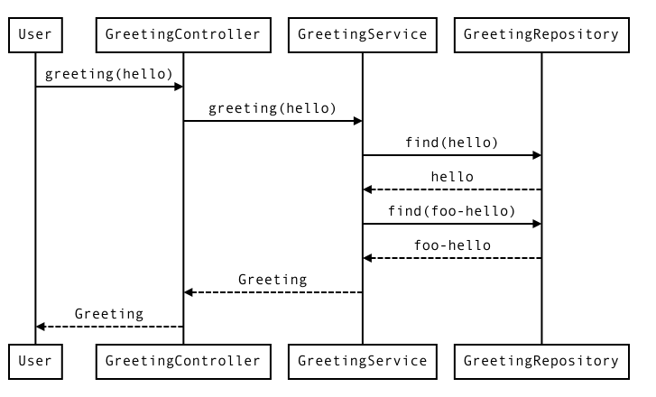
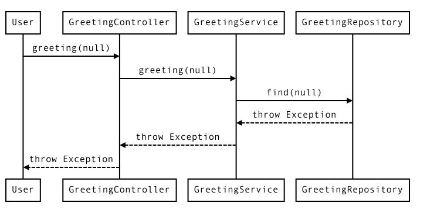

= AdonisTrack image:https://img.shields.io/badge/License-Apache%202.0-blue.svg["License", link="https://opensource.org/licenses/Apache-2.0"] image:https://maven-badges.herokuapp.com/maven-central/com.woozooha/adonistrack/badge.svg["Maven Central", link="https://maven-badges.herokuapp.com/maven-central/com.woozooha/adonistrack"]

Simple Java profiling tool. (The light version of 'hazin-tracer')

* You can trace the call stack immediately.
* There is no need to write code to track method calls.
* Provide method call information(parameters, return, error and execution time).
* Compatible with the Spring Framework.
* The information is not intermixed with concurrent calls.
* Provides extension points to customize.

== Usage

=== 1. Add this library to your project

image:https://maven-badges.herokuapp.com/maven-central/com.woozooha/adonistrack/badge.svg["Maven Central", link="https://maven-badges.herokuapp.com/maven-central/com.woozooha/adonistrack"]

=== 2. Add AdonistrackFilter to your application

* If your application is not a web application, skip this section.

.Application.java
[source,java,indent=0]
----
package com.woozooha.adonistrack.test.spring;

import org.springframework.boot.SpringApplication;
import org.springframework.boot.autoconfigure.SpringBootApplication;
import org.springframework.boot.web.servlet.FilterRegistrationBean;
import org.springframework.context.annotation.Bean;

import com.woozooha.adonistrack.filter.AdonistrackFilter;

@SpringBootApplication
public class Application {

    public static void main(String[] args) {
        SpringApplication.run(Application.class, args);
    }

    @Bean
    public FilterRegistrationBean<AdonistrackFilter> profileFilter() {
        FilterRegistrationBean<AdonistrackFilter> registrationBean = new FilterRegistrationBean<AdonistrackFilter>();

        registrationBean.setFilter(new AdonistrackFilter());
        registrationBean.addUrlPatterns("/*");

        return registrationBean;
    }

}
----

=== 3. Configure your aspect to profile

* Create a aspect by extending the `ProfileAspect`, such as `AdonisTrackAspect.java`
* Configure `profilePointcut` and `executionPointcut` of the aspect by using pointcut expression.
* You can set profile targets using pointcut expressions.
If you run into problems, you may need to change this @Pointcut expression.
The page below will help you.
https://howtodoinjava.com/spring-aop/aspectj-pointcut-expressions/

.AdonisTrackAspect.java
[source,java,indent=0]
----
package com.woozooha.adonistrack.test.spring;

import org.aspectj.lang.annotation.Aspect;
import org.aspectj.lang.annotation.Pointcut;
import org.springframework.stereotype.Component;

import com.woozooha.adonistrack.aspect.ProfileAspect;

@Aspect
@Component
public class AdonisTrackAspect extends ProfileAspect {

    /**
     * Fix this @Pointcut expression according to your situation. For
     * example, modify "com.woozooha.adonistrack.test.spring" to your application's
     * top-level package name "com.yourcompany.killerapp".
     */
    @Pointcut("execution(* *(..)) && (within(com.woozooha.adonistrack.test.spring..*) || within(com.woozooha.adonistrack.test.spring..*+))")
    public void executionPointcut() {
    }

}
----

=== 4. Run your application with above aspect `AdonistrackFilter` configuration and `AdonisTrackAspect.java`

.Runing application log
[indent=0]
----
  .   ____          _            __ _ _
 /\\ / ___'_ __ _ _(_)_ __  __ _ \ \ \ \
( ( )\___ | '_ | '_| | '_ \/ _` | \ \ \ \
 \\/  ___)| |_)| | | | | || (_| |  ) ) ) )
  '  |____| .__|_| |_|_| |_\__, | / / / /
 =========|_|==============|___/=/_/_/_/
 :: Spring Boot ::        (v2.1.3.RELEASE)

2019-04-17 13:45:18.014  INFO 254732 --- [           main] com.woozooha.hello.Application           : Starting Application ...
2019-04-17 13:45:33.663  INFO 254732 --- [nio-8080-exec-1] o.s.web.servlet.DispatcherServlet        : Completed initialization in 10 ms
----

=== 5. Call your application and check the log

When your application is called via `GET /greeting?name=hello HTTP/1.1`

* This is the log when the execution was successful.

.Output log
[indent=0]
----
----> [REQUEST] GET http://localhost:8080/greeting/1 (230.83ms:100.00%)
    ----> com.woozooha.adonistrack.test.spring.GreetingController.greeting(1) (29.40ms:100.00%)
        ----> com.woozooha.adonistrack.test.spring.GreetingService.greeting(1) (25.33ms:100.00%)
            ----> com.sun.proxy.$Proxy87.findById(1) (19.92ms:100.00%)
            <---- Optional[Greeting(id=1, content=Hello\nfoo)]
        <---- Greeting(id=1, content=Hello\nfoo)
    <---- Greeting(id=1, content=Hello\nfoo)
<---- [RESPONSE] 200
----

* The above log means the following sequence diagram.

* This is the log when the execution was failed.

.Output log
[indent=0]
----
----> [REQUEST] GET http://localhost:8080/greeting/2 (21.97ms:100.00%)
    ----> com.woozooha.adonistrack.test.spring.GreetingController.greeting(2) (5.60ms:100.00%)
        ----> com.woozooha.adonistrack.test.spring.GreetingService.greeting(2) (1.66ms:100.00%)
            ----> com.sun.proxy.$Proxy87.findById(2) (0.71ms:100.00%)
            <---- Optional.empty
        <<<<< java.util.NoSuchElementException: No value present
    <<<<< java.util.NoSuchElementException: No value present
<---- [RESPONSE] 200
----

* The above log means the following sequence diagram.

=== 6. More options

Adonistrack supports load-time-weaving for even more powerful profiling.
If you want to profile JDBC queries, do the following.

* Add aop.xml file to your application project.

./META-INF/aop.xml
[source,xml,indent=0]
----
<!DOCTYPE aspectj PUBLIC "-//AspectJ//DTD//EN" "http://www.eclipse.org/aspectj/dtd/aspectj.dtd">
<aspectj>
    <weaver options="">
        <include within="java.sql.Statement+" />
        <include within="java.sql.Connection+" />
        <include within="com.woozooha.adonistrack.aspect.JdbcAspect" />
    </weaver>
    <aspects>
        <aspect name="com.woozooha.adonistrack.aspect.JdbcAspect" />
    </aspects>
</aspectj>
----

* Add VM arguments when run your application. 

.Vm arguments
----
-javaagent:/{your-home-path}/.m2/repository/org/aspectj/aspectjweaver/1.9.2/aspectjweaver-1.9.2.jar
----

You can now see that the JDBC query is profiled as shown below.

.Output log
[indent=0]
----
----> [REQUEST] GET http://localhost:8080/greeting/1 (227.91ms:100.00%)
    ----> com.woozooha.adonistrack.test.spring.GreetingController.greeting(1) (36.04ms:100.00%)
        ----> com.woozooha.adonistrack.test.spring.GreetingService.greeting(1) (31.40ms:100.00%)
            ----> com.sun.proxy.$Proxy88.findById(1) (26.41ms:100.00%)
                  | [JDBC] [sql=select greeting0_.id as id1_0_0_, greeting0_.content as content2_0_0_ from greeting greeting0_ where greeting0_.id=?, parameterMap={1=1}]
            <---- Optional[Greeting(id=1, content=Hello\nfoo)]
        <---- Greeting(id=1, content=Hello\nfoo)
    <---- Greeting(id=1, content=Hello\nfoo)
<---- [RESPONSE] 200
----

== License

AdonisTrack is Open Source software released under the Apache 2.0 license.

== AdonisTrack?

The flower language of Adonis is "sad memories" in the West but "eternal happiness" in the East.

